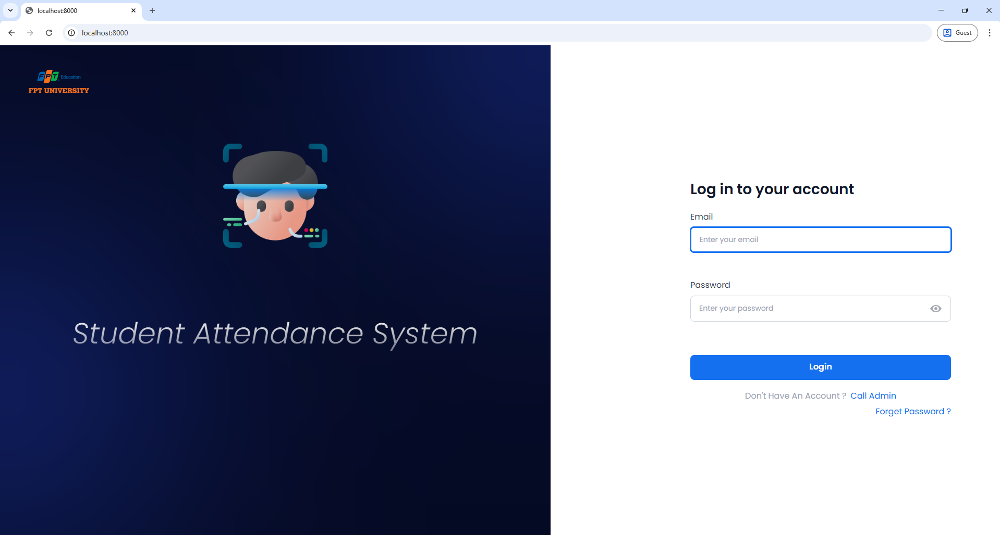
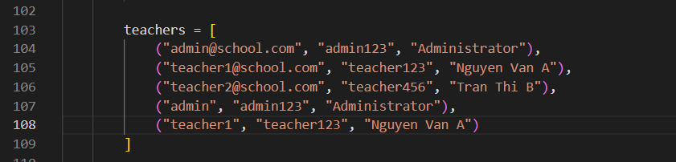
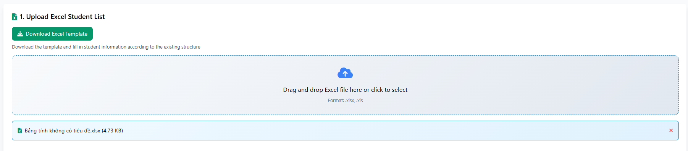
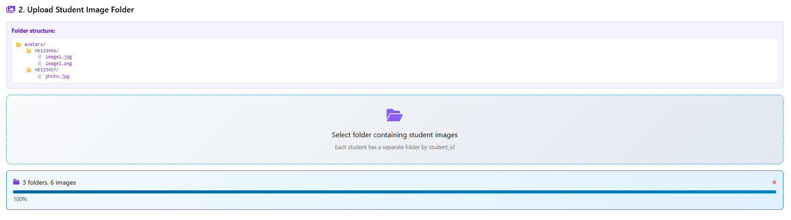
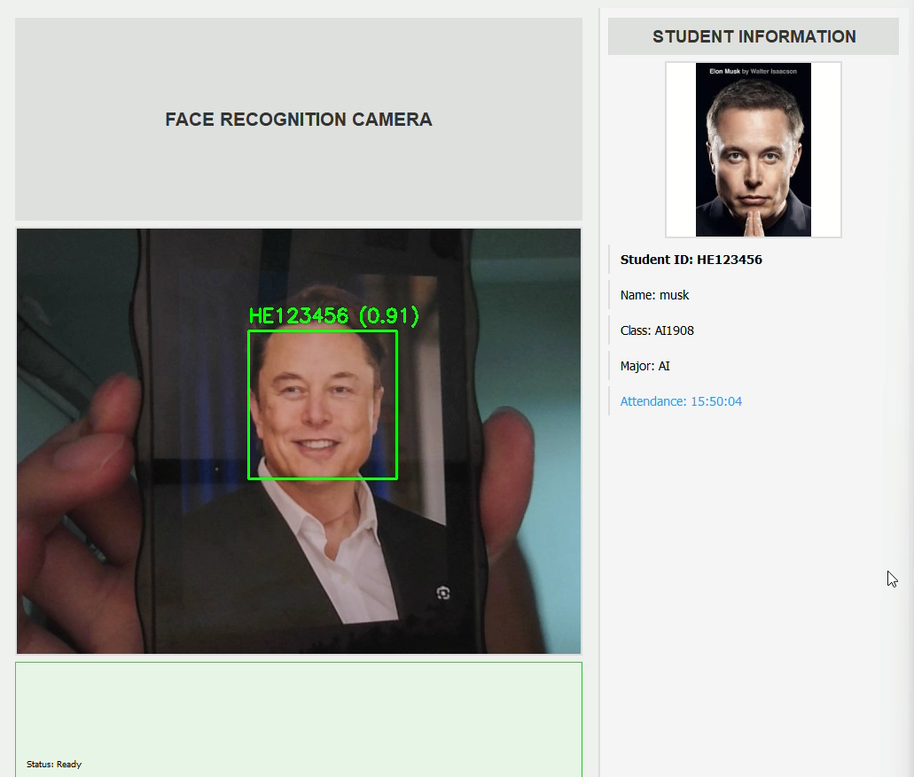

# 🧑‍🏫 Face Recognition Attendance System

The system leverages `FaceNet` for accurate facial recognition, with a `FastAPI` backend and a lightweight web interface built using `HTML`, `CSS`, and `JavaScript`. It delivers a user-friendly solution for student attendance tracking.

## ✨ Features

- **Real-time Face Recognition**: Automatic attendance tracking using advanced face recognition algorithms
- **Web Dashboard**: Modern, responsive web interface for teachers and administrators
- **Bulk Student Management**: Add multiple students with `Excel` file upload and image folder processing
- **Real-time Updates**: `WebSocket-based` real-time attendance notifications
- **Secure Authentication**: Teacher login system with password encryption
- **Database Management**: `SQLite` database for student records and attendance data
- **Vector Search**: `Qdrant vector database` for efficient face embedding storage and retrieval

## 🧰 Technology Stack

### 🔙 Backend
- **FastAPI**: Modern Python web framework for building APIs
- **OpenCV**: Computer vision library for image processing
- **FaceNet PyTorch**: Pre-trained face recognition model
- **Qdrant**: Vector database for face embeddings
- **SQLite**: Database for student records and attendance
- **PyQt5**: Desktop application framework

### 🔜 Frontend
- **HTML5/CSS3**: Modern web standards
- **JavaScript (ES6+)**: Interactive user interface
- **Tailwind CSS**: Utility-first CSS framework
- **WebSocket**: Real-time communication
- **Font Awesome**: Icon library

## 🗂️ Project Structure

```
face/
├── frontend/                  # Web interface files
│   ├── dashboard.html        # Main dashboard interface
│   ├── dashboard.js          # Dashboard functionality
│   ├── dashboard.css         # Dashboard styling
│   ├── add-students.html     # Student management interface
│   ├── add-students.js       # Student management functionality
│   ├── login.html            # Login interface
│   ├── script.js             # Login functionality
│   ├── style.css             # Login styling
│   ├── globals.css           # Global styles
│   ├── styleguide.css        # Style guide
│   ├── logo.png              # Application logo
│   └── icon.png              # Application icon
├── src/                      # Source code
│   ├── main.py               # PyQt5 desktop application
│   ├── api_main.py           # FastAPI backend server
│   ├── data.py               # Face data processing
│   ├── database.py           # Database operations
│   ├── students.db           # SQLite database
│   ├── students.xlsx         # Student data Excel file
│   ├── haarcascade_frontalface_default.xml  # Face detection model
│   └── Dockerfile            # Docker configuration
├── avatars/                  # Student photo storage
│   ├── HE123456/            # Student folder (by ID)
│   │   ├── download.jpg     # Student photos
│   │   └── download (1).jpg
│   └── HE123457/
│       ├── download.jpg
│       └── download (1).jpg
├── requirements.txt          # Python dependencies
└── README.md                # This file
```

## 🚀 Installation

### Prerequisites
- Python 3.8 or higher
- Qdrant vector database
- Webcam (for face recognition)

### 1. Clone the Repository
```bash
git clone https://github.com/QDung210/Student-Attendance-System.git
cd Student-Attendance-System
```

### 2. Install Python Dependencies
```bash
pip install -r requirements.txt
```

### 3. Install and Start Qdrant
```bash
cd src
docker build -t my-qdrant .
docker run -d -p 6333:6333 --name qdrant-server my-qdrant
```

### 4. Prepare Database
```bash
cd src
python database.py
```

## ▶️ Usage

### Starting the System

```bash
# Start the API server
cd src
python api_main.py

# In another terminal, start the desktop application
python main.py
```

### 👨‍🎓 Adding Students

1. **Access the Web Interface**  
   Open [http://localhost:8000](http://localhost:8000) in your browser  
   

2. **Login**  
   Use default credentials. You can find or change the default accounts in [`database.py`](src/database.py)  
   

3. **Navigate to Add Students**  
   Click "Add Students" in the dashboard

4. **Upload Excel File**  
   - Download the sample Excel template  
   - Fill in student information (`student_id`, `name`, `class`, `major`)  
   - Upload the completed Excel file  
   

5. **Upload Images**  
   - Create folders named with student IDs  
   - Add student photos to respective folders  
   - Upload the entire images folder  
   

   ⚠️ **Important:** You must name each folder containing student photos using the `student’s ID`, which must match the `student_id` column in the Excel file. Otherwise, the system will not function correctly.

6. **Process Data**  
   Click "Process Data" to generate face embeddings


### 🎯 Taking Attendance

1. **Start Desktop Application**  
   Run `python main.py`  
   

2. **Camera Setup**  
   Ensure webcam is connected and working

3. **Face Recognition**  
   Students stand in front of the camera

4. **Automatic Logging**  
   System automatically recognizes and logs attendance

5. **Real-time Updates**  
   Dashboard shows real-time attendance updates

## 🔗 API Endpoints

### Authentication
- `POST /login` - Teacher login

### Attendance
- `GET /today-checkins` - Get today's attendance list
- `POST /notify-attendance` - Send attendance notification
- `WS /ws/attendance` - WebSocket for real-time updates

### Student Management
- `POST /api/upload-excel` - Upload Excel file with student data
- `POST /api/upload-images` - Upload student images folder
- `POST /api/process-data` - Process face data and generate embeddings
- `POST /api/update-database` - Update database with processed data

### Utilities
- `GET /sample-excel` - Download sample Excel template


## 📄 License
This project is licensed under the MIT License - see the LICENSE file for details.

**Note**: This system is designed for educational and small-scale institutional use. For production deployment, consider additional security measures, scalability improvements, and compliance with privacy regulations.

## 📽️ Demo

[](https://www.youtube.com/watch?v=QmktoFAOmxM)
